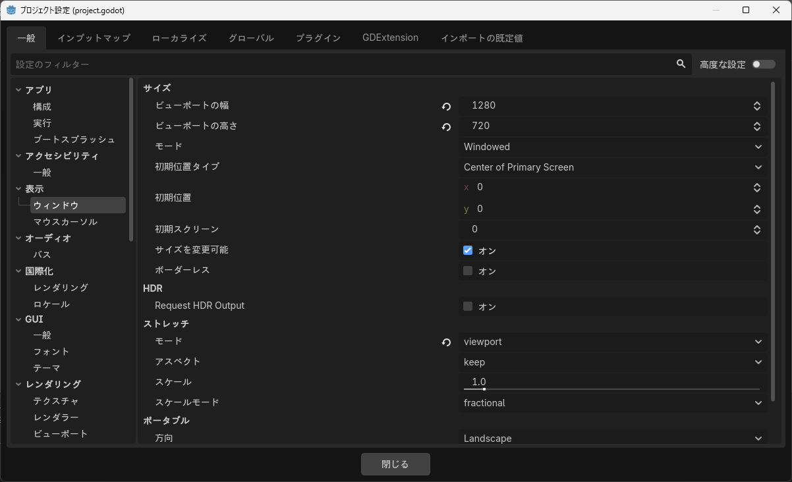

# ゲームの設定

## 画面サイズ

### 標準設定

標準的には、下図のように設定する。

- サイズ
    - ビューポートの幅: 1280
    - ビューポートの高さ: 720（アスペクト比16:9）
- ストレッチ
    - モード: viewport
    - アスペクト: keep

これにより、基本の描画サイズを1280x720の比率16:9とし、収まるように上下または左右に余白を入れるようになる。

### 参考ページ

- [【Godot4入門】画面サイズを変更する方法](https://shin-jo.net/2025/12/godot4-viewport/)

## 最初のシーンを作る

プロジェクト作成直後は再生ボタンを押してもゲームをプレイできない。

Godotではシーン、オブジェクトなどはいずれもSceneとして作成する。

main下にシーンmain.tscnを作成する。

これを「最初のシーン」に指定する。再生ボタンを押すと、真っ暗な画面だが、ゲームを再生できる。

